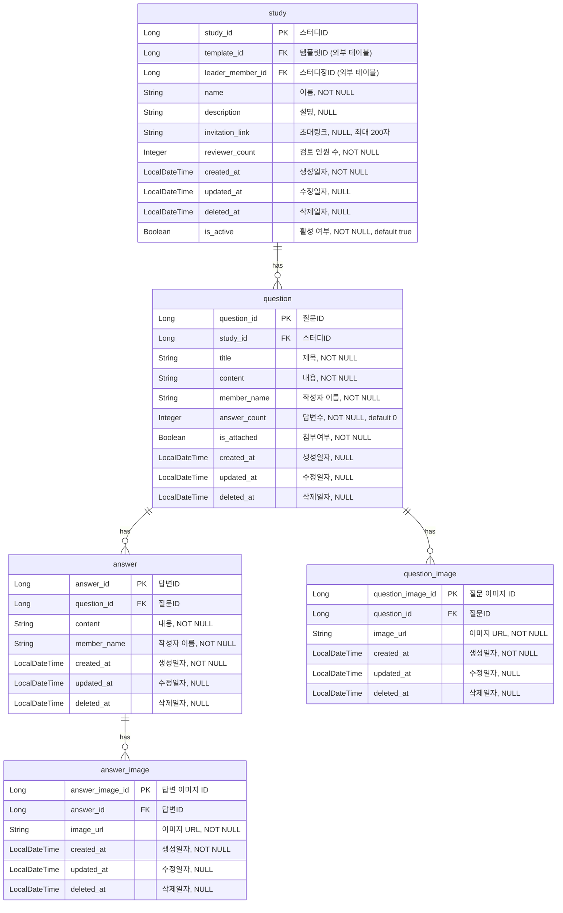

# inquiry(질문함/QNA) 도메인 작업 가이드

이 문서는 `inquiry` 도메인(질문함/QNA 기능) 작업을 위한 스코프와 참고 자료를 정리한 것입니다.
아직 구현 지시가 아니라 **작업 범위를 고정하는 하네스 문서**이므로, 이 파일을 근거로 실제 코드를
변경할 때는 아래 규칙을 반드시 지켜야 합니다.

## 0. 절대 규칙 — 작업 범위 제한

- **`inquiry` 도메인 외의 어떤 도메인/파일도 한 줄도 수정하지 않는다.**
  - 수정 가능 범위: `src/main/java/com/stology/be/domain/inquiry/**`
    (필요 시 `src/main/resources/static/**` 아래 샘플 프론트엔드 추가)
  - 수정 금지: `domain/auth`, `domain/member`, `domain/node`, `domain/study`(엔티티 포함),
    `global/**` 등 inquiry 외 모든 코드
  - `Question`/`Answer`/`QuestionImage`/`AnswerImage` 엔티티는 현재
    `domain/inquiry/entity` 아래 있지만 내부 `package` 선언이
    `com.stology.be.domain.study.entity`로 되어 있음 — 이 파일들은 inquiry 도메인 소유이므로
    수정 대상에 포함되지만, `study` 패키지의 다른 파일(`Study`, `MemberStudy`, `Report`)은 건드리지 않는다.
  - `Study`, `Member` 등 다른 도메인 엔티티는 **읽기 전용으로 참조만** 한다 (FK 연결 등).

## 1. 목표

1. **다중 이미지 업로드 API** — 질문(question)과 답변(answer) 각각에 대해 여러 장의 이미지를
   업로드할 수 있는 API를 S3 연동으로 작성한다. AWS 자격 증명은 `.env`(`AWS_ACCESS_KEY`,
   `AWS_SECRET_KEY`)에 이미 있고, `application.yaml`에 리전(`ap-northeast-2`)과 버킷
   (`stology-s3`, path `dev/`)이 설정되어 있다. 아직 프로젝트 어디에도 S3 업로드 코드가 없으므로
   신규로 작성해야 한다 (`spring-cloud-aws-starter-s3` 의존성은 `build.gradle`에 이미 포함됨).
2. **브라우저로 확인 가능한 샘플 프론트엔드** — `stology/연습` 프로젝트가 쓰는 패턴을 그대로 따른다.
   `연습/src/main/resources/static/{index.html, assets/app.js, assets/style.css}` 처럼
   순수 정적 HTML/JS/CSS를 Spring Boot의 `src/main/resources/static`에 두고, 별도 프레임워크
   없이 fetch로 inquiry API를 직접 호출해 브라우저에서 질문/답변/이미지 업로드 흐름을 확인할 수
   있게 만든다.

## 2. 반드시 고려해야 할 참고 자료

`C:\Users\suyea\Desktop\stology\연습에서 볼 자료\` 아래 모든 자료를 기준으로 작업한다. 특히:

- `프로젝트 ERD.md` — ERD 원본 (아래 3번 참고, 엔티티 절대 변경 금지)
- `기능 명세서.md`, `❓ 6 질문함 (1) ....md` — 질문함(QNA) 화면 기능 명세
  (질문 목록/상세 펼침/작성·수정/답글 작성·수정/삭제, 예외 케이스 포함)
- `09-01 ~ 09-09 QNA001*.pdf` — 질문함 관련 와이어프레임 (게시글 펼침, 질문 작성, 답글 수정,
  빈 상태, 질문 수정, 삭제 확인, 종료 스터디 질문함, 질문 작성 검증, 질문 권한/삭제 예외)
- `00. 작성 기준.pdf` — 전체 문서 작성 기준
- `API 명세서 (1) ...csv` / `...all.csv` — API 엔드포인트 목록 (담당자/우선순위 포함).
  질문함 관련 행: 질문 작성 `POST /api/study/{studyid}/question`,
  질문 목록 조회 `GET /api/study/{studyid}/question`,
  질문 상세 조회 `GET /api/study/{studyid}/question/{questionid}`,
  질문 수정 `POST /api/study/{studyid}/question/{questionid}`,
  질문 삭제 `DELETE /api/study/{studyid}/question/{questionid}`,
  답글 작성 `POST /api/study/{studyid}/question/{questionid}/answer`,
  답글 수정 `PATCH /api/study/{studyid}/question/{questionid}/answer/{anwerid}`,
  답글 삭제 `DELETE /api/study/{studyId}/question/{questionId}/answer/{answerId}`,
  답글 작성 이미지 첨부 `POST /api/study/{studyId}/question/{questionId}/image`
  (신규 이미지 업로드 API는 이 명세와 일관되게 경로를 설계할 것)
- `질문함 참고 자료.md` — Git 브랜치 전략, 코드 컨벤션, 공통 응답 포맷(`ApiResponse`/
  `BaseCode`/`GeneralException`/`@RestControllerAdvice`) 설계 근거. BE 프로젝트의
  `global/apiPayload` 구조가 이 문서의 패턴을 따르고 있으므로 inquiry 도메인도 동일한
  `ApiResponse`/`InquirySuccessCode`/`InquiryErrorCode`/`InquiryException` 패턴을 유지한다.

## 3. ERD — 엔티티 절대 변경 금지

출처: `연습에서 볼 자료/프로젝트 ERD.md`. 아래 5개 엔티티와 컬럼 구성은 **절대 변경하지 않는다**
(컬럼 추가/삭제/타입 변경 전부 금지, 신규 컬럼이 필요해 보여도 우선 이 문서 기준을 따른다).

- 현재 `domain/inquiry/entity`의 `Question`/`Answer`/`QuestionImage`/`AnswerImage` 필드는
  위 ERD와 정확히 일치한다 (`title`/`content`/`memberName`/`answerCount`/`isAttached`,
  `content`/`memberName`, `imageUrl`+FK, `imageUrl`+FK). 이미지 업로드 API를 추가할 때도
  `image_url` 컬럼(문자열 URL 저장 방식)을 그대로 사용하고, 새 컬럼을 추가하지 않는다.

## 4. 현재 코드 상태 메모 (구현 전 확인 필요)

- `InquiryController`의 `writeInquiry`, `updateInquiry`, `attachImage`, `writeReply` 메서드에
  `@PostMapping`/`@PatchMapping` 등 HTTP 매핑 애노테이션이 빠져 있어 실제로는 엔드포인트로
  노출되지 않는 상태다.
- `InquiryConverter`/`InquiryServiceImpl`이 `question.getBody()`, `question.getMember()`,
  `reply.getImageList()` 등 현재 엔티티(`title`/`content`/`memberName`만 존재)에는 없는
  필드·메서드를 참조하고 있다. 실제 구현에 들어가기 전에 이 불일치를 먼저 확인하고, ERD 기준
  필드명(`content`, `memberName`)에 맞춰 서비스/컨버터 쪽을 정리해야 한다 (엔티티가 아니라
  서비스/컨버터를 ERD에 맞추는 방향).

## 5. S3 이미지 업로드 API 설계 방향

- 대상: 질문 작성/수정 시 다중 이미지, 답변 작성/수정 시 다중 이미지.
- 버킷/경로: `application.yaml`의 `spring.cloud.aws.s3.bucket=stology-s3`,
  `path=dev/` (로컬), prod는 `${S3_PATH}` — 이미지 key에 이 path prefix를 사용한다.
- 저장 방식: 업로드 성공 후 `image_url`(S3 객체 URL)만 `question_image`/`answer_image` 테이블에
  저장한다 (ERD에 이미 정의된 컬럼, 3번 항목 참고).
- API 명세서(`API 명세서 (1)...csv`)의 `POST /api/study/{studyId}/question/{questionId}/image`
  경로 네이밍 관례를 참고해 답변 이미지 API 경로도 일관되게 설계한다.

## 6. 샘플 프론트엔드 설계 방향

- `stology/연습` 프로젝트의 `src/main/resources/static/index.html` + `assets/app.js` +
  `assets/style.css` 구성을 참고해, BE 프로젝트의 `src/main/resources/static`에 동일한 패턴으로
  둔다.
- 프레임워크 없이 순수 HTML/CSS/vanilla JS(fetch)로 inquiry API(질문 목록/상세/작성/수정/삭제,
  답글 작성/수정/삭제, 이미지 업로드)를 호출해 브라우저에서 바로 확인할 수 있어야 한다.
- `./gradlew bootRun`으로 앱을 띄우면 `http://localhost:8080/index.html`(또는 정적 리소스
  기본 경로)에서 바로 접근 가능해야 한다.
