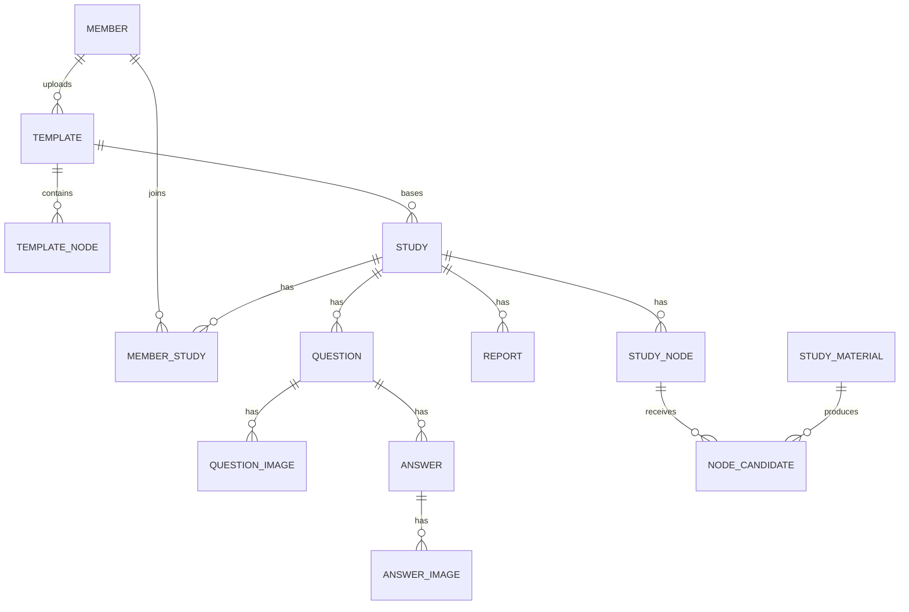

# 데이터베이스 스키마

이 문서는 현재 JPA 엔티티와 애플리케이션 설정을 기준으로 관계형 데이터베이스 구조를 정리합니다. 별도 DDL 또는 Flyway/Liquibase 마이그레이션은 없으며, 기본 설정은 MySQL dialect와 `ddl-auto: create`, 프로덕션 설정은 MySQL dialect와 `ddl-auto: update`를 사용합니다.

따라서 아래 내용은 **현재 코드에서 도출되는 Hibernate 매핑**입니다. 특히 프로덕션 데이터베이스에는 과거 `update` 실행으로 남은 컬럼·제약이 있을 수 있으므로 실제 운영 스키마의 완전한 사본으로 간주하지 않습니다.

## 이름과 타입 해석 기준

- `@Table`, `@Column(name = ...)`이 없는 엔티티·필드는 현재 Spring Boot/Hibernate naming strategy에 따라 snake case로 적었습니다. 예: `MemberStudy` → `member_study`, `socialUid` → `social_uid`.
- 모든 엔티티의 `id`는 `Long`이며 `IDENTITY` 방식의 기본 키입니다.
- 별도 길이 지정이 없는 `String`은 Hibernate의 기본 문자열 매핑을 사용합니다. `Report`의 일부 필드만 코드에서 `json` 또는 `text`로 명시합니다.
- 모든 엔티티는 `BaseEntity`를 상속하므로 `created_at`, `updated_at`, `deleted_at`을 공유합니다.
- `@JoinColumn`에 `nullable = false`가 없고 연관 필드도 `optional = false`가 아니므로 외래 키 컬럼의 NOT NULL 제약은 코드에 명시되어 있지 않습니다.
- `@Builder.Default`는 Lombok builder로 객체를 생성할 때의 Java 기본값이며 DB의 `DEFAULT` 제약이 아닙니다.

## 관계 개요

코드의 모든 연관은 단방향 `@ManyToOne(fetch = LAZY)`입니다. 반대 방향 컬렉션, cascade, orphan removal은 선언되어 있지 않습니다. 다이어그램의 `||--o{`는 참조 방향과 다대일 구조를 읽기 쉽게 표현한 것이며, 코드가 외래 키 컬럼에 NOT NULL을 명시한다는 의미는 아닙니다.

## 공통 컬럼

아래 컬럼은 13개 엔티티 테이블에 모두 포함됩니다.

| 컬럼 | Java 타입 | 매핑 및 의미 |
| --- | --- | --- |
| `created_at` | `LocalDateTime` | `@CreatedDate`, 수정 불가(`updatable = false`) |
| `updated_at` | `LocalDateTime` | `@LastModifiedDate` |
| `deleted_at` | `LocalDateTime` | soft delete 시각, 코드상 nullable |

## 회원

### `member`

| 컬럼 | Java 타입 | 키/제약 및 매핑 |
| --- | --- | --- |
| `id` | `Long` | PK, identity |
| `name` | `String` | Bean Validation `@NotBlank` |
| `social_type` | `SocialType` | 문자열 enum, `@NotNull`; 현재 값: `KAKAO` |
| `social_uid` | `String` | Bean Validation `@NotBlank` |
| `email` | `String` | Bean Validation `@Email`, `@NotBlank` |

코드에는 `social_type`과 `social_uid` 조합을 조회하는 repository 메서드가 있지만, 해당 조합의 UNIQUE 제약이나 인덱스는 선언되어 있지 않습니다.

## 노드와 템플릿

### `template`

| 컬럼 | Java 타입 | 키/제약 및 매핑 |
| --- | --- | --- |
| `id` | `Long` | PK, identity |
| `uploader` | `Long` | FK → `member.id` |
| `name` | `String` | 별도 컬럼 제약 없음 |
| `description` | `String` | 별도 컬럼 제약 없음 |

### `template_node`

| 컬럼 | Java 타입 | 키/제약 및 매핑 |
| --- | --- | --- |
| `id` | `Long` | PK, identity |
| `template_id` | `Long` | FK → `template.id` |

### `study_node`

| 컬럼 | Java 타입 | 키/제약 및 매핑 |
| --- | --- | --- |
| `id` | `Long` | PK, identity |
| `study_id` | `Long` | FK → `study.id` |
| `active_level` | `Integer` | builder 생성 기본값 `0`; DB DEFAULT는 선언되지 않음 |

### `study_material`

| 컬럼 | Java 타입 | 키/제약 및 매핑 |
| --- | --- | --- |
| `id` | `Long` | PK, identity |
| `file_url` | `String` | 별도 컬럼 제약 없음 |

### `node_candidate`

| 컬럼 | Java 타입 | 키/제약 및 매핑 |
| --- | --- | --- |
| `id` | `Long` | PK, identity |
| `study_material_id` | `Long` | FK → `study_material.id` |
| `study_node_id` | `Long` | FK → `study_node.id` |
| `state` | `CandidateState` | 문자열 enum; 현재 값: `ACCEPT`, `DECLINED`, `PENDING`; builder 생성 기본값 `PENDING` |
| `accept_count` | `Integer` | builder 생성 기본값 `0`; DB DEFAULT는 선언되지 않음 |

## 스터디

### `study`

| 컬럼 | Java 타입 | 키/제약 및 매핑 |
| --- | --- | --- |
| `id` | `Long` | PK, identity |
| `template_id` | `Long` | FK → `template.id` |
| `name` | `String` | 별도 컬럼 제약 없음 |
| `description` | `String` | 별도 컬럼 제약 없음 |
| `invitation_link` | `String` | 별도 컬럼 제약 없음 |
| `reviewer_count` | `Integer` | 별도 컬럼 제약 없음 |
| `is_active` | `Boolean` | builder 생성 기본값 `true`; DB DEFAULT는 선언되지 않음 |
| `study_leader` | `String` | 별도 컬럼 제약 없음 |

### `member_study`

| 컬럼 | Java 타입 | 키/제약 및 매핑 |
| --- | --- | --- |
| `id` | `Long` | PK, identity |
| `member_id` | `Long` | FK → `member.id` |
| `study_id` | `Long` | FK → `study.id` |

`member_id`와 `study_id` 조합의 UNIQUE 제약은 선언되어 있지 않습니다.

### `question`

| 컬럼 | Java 타입 | 키/제약 및 매핑 |
| --- | --- | --- |
| `id` | `Long` | PK, identity |
| `study_id` | `Long` | FK → `study.id` |
| `title` | `String` | 별도 컬럼 제약 없음 |
| `content` | `String` | 별도 컬럼 제약 없음 |
| `member_name` | `String` | 별도 컬럼 제약 없음 |
| `answer_count` | `Integer` | builder 생성 기본값 `0`; DB DEFAULT는 선언되지 않음 |
| `is_attached` | `Boolean` | 별도 컬럼 제약 없음 |

### `question_image`

| 컬럼 | Java 타입 | 키/제약 및 매핑 |
| --- | --- | --- |
| `id` | `Long` | PK, identity |
| `question_id` | `Long` | FK → `question.id` |
| `image_url` | `String` | 별도 컬럼 제약 없음 |

### `answer`

| 컬럼 | Java 타입 | 키/제약 및 매핑 |
| --- | --- | --- |
| `id` | `Long` | PK, identity |
| `question_id` | `Long` | FK → `question.id` |
| `content` | `String` | 별도 컬럼 제약 없음 |
| `member_name` | `String` | 별도 컬럼 제약 없음 |

### `answer_image`

| 컬럼 | Java 타입 | 키/제약 및 매핑 |
| --- | --- | --- |
| `id` | `Long` | PK, identity |
| `answer_id` | `Long` | FK → `answer.id` |
| `image_url` | `String` | 별도 컬럼 제약 없음 |

### `report`

| 컬럼 | Java 타입 | 키/제약 및 매핑 |
| --- | --- | --- |
| `id` | `Long` | PK, identity |
| `study_id` | `Long` | FK → `study.id` |
| `total_node_count` | `Integer` | builder 생성 기본값 `0`; DB DEFAULT는 선언되지 않음 |
| `new_active_node_count` | `Integer` | builder 생성 기본값 `0`; DB DEFAULT는 선언되지 않음 |
| `reinforced_node_count` | `Integer` | builder 생성 기본값 `0`; DB DEFAULT는 선언되지 않음 |
| `weekly_core_node_list` | `String` | MySQL `json`으로 명시 |
| `ai_review_content` | `String` | MySQL `text`로 명시 |
| `recommended_node_list` | `String` | MySQL `json`으로 명시 |
| `follow_up_content` | `String` | MySQL `text`로 명시 |
| `member_activity_statistics_list` | `String` | MySQL `json`으로 명시 |

JSON 컬럼의 Java 타입은 구조화된 객체가 아닌 `String`입니다. 코드에는 JSON 변환기나 구체적인 JSON 내부 스키마가 선언되어 있지 않습니다.

## 명시적으로 선언되지 않은 제약

현재 엔티티에는 다음 데이터베이스 제약이 선언되어 있지 않습니다.

- 기본 키 이외의 UNIQUE 제약
- 명시적 보조 인덱스
- 외래 키 컬럼의 NOT NULL
- 연관 삭제/갱신 cascade 규칙
- 문자열 길이, 숫자 범위, CHECK 제약
- DB 수준의 컬럼 기본값

Bean Validation의 `@NotBlank`, `@NotNull`, `@Email`은 `member` 엔티티 객체 검증에 사용되지만, 이 문서에서는 이를 명시적인 JPA `nullable = false`나 데이터베이스 CHECK 제약으로 간주하지 않습니다.

## 관계형 DB 밖의 저장 데이터

refresh token은 RDB 테이블이 아니라 Redis에 `refresh:{uid}` 키로 저장되며 TTL을 가집니다. 따라서 위 스키마와 테이블 목록에는 포함하지 않습니다.

## 확인할 소스

- 공통 필드: `src/main/java/com/stology/be/global/entity/BaseEntity.java`
- 회원: `src/main/java/com/stology/be/domain/member/entity/Member.java`
- 노드·템플릿: `src/main/java/com/stology/be/domain/node/entity/`
- 스터디: `src/main/java/com/stology/be/domain/study/entity/`
- DB/JPA 설정: `src/main/resources/application.yaml`, `src/main/resources/application-prod.yaml`
